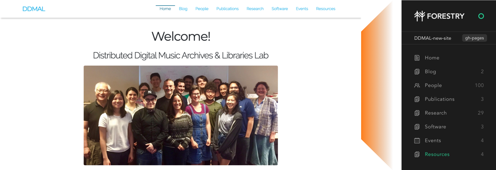
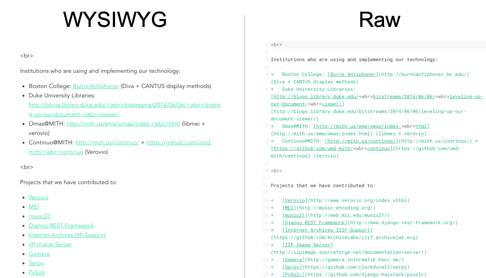
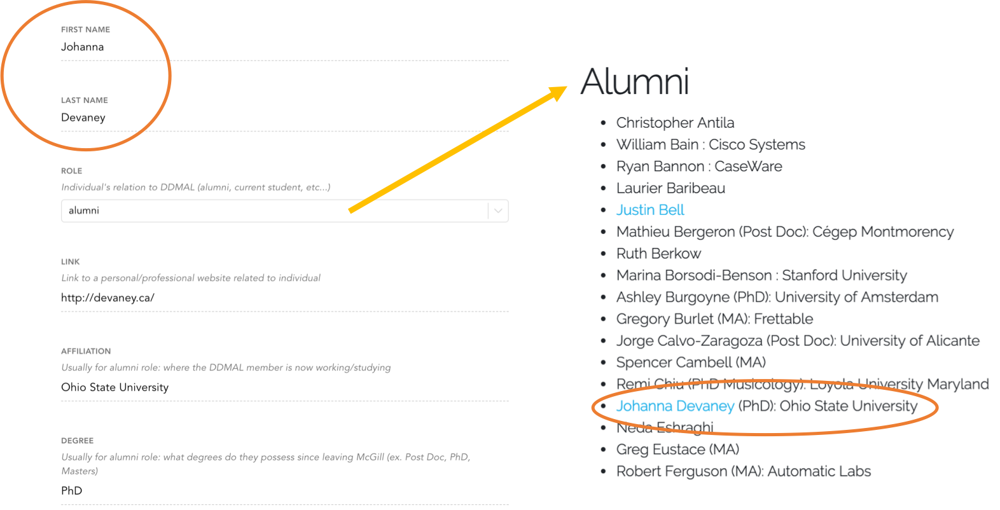

# [DDMAL](https://DDMAL.github.io/DDMAL-new-site)

This is the repository for the new DDMAL website distributed via GitHub Pages. It is a static website built using Jekyll, meaning that there is no backend presence, and the entirety of the site is stored in this repository, blog contents included. The formatting was adapted from the Lanyon theme, developed by Mark Otto.

## Contents

- [Local Setup](#local-setup)
- [CMS](#cms)
  - [CMS Navigation](#cms-navigation)
  - [Organization](#organization)
  - [Media](#media)
- [Troubleshooting](#troubleshooting)

## Local Setup

### RVM (Mac) / Windows Install

You will need to download a full [Ruby development environment](https://jekyllrb.com/docs/installation/) to install Jekyll. Follow steps 1 and 2 of [these instructions](https://jekyllrb.com/docs/) after installing Ruby.

Mac users may need to install RVM to configure the local Ruby version correctly, and [here](https://usabilityetc.com/articles/ruby-on-mac-os-x-with-rvm/) is a link with instructions on how-to.

Assuming you have [Git](https://www.atlassian.com/git/tutorials/install-git) installed, open a terminal and clone the repository into any known location on your computer. The documents folder is recommended, though it is up to you.

### Configuration and building site locally

```
git clone https://github.com/DDMAL/ddmal.github.io.git
```

Enter the directory with `cd ddmal.github.io`, and pull from the repository to your local folder. Specifically, pull from the 'master' branch, the branch used by GitHub Pages to host the site.

```
git pull origin master
```

At this point, the site is able to be edited and run locally. Assuming steps 1 and 2 of the Jekyll documentation were followed correctly, run:

```
bundle exec jekyll serve --watch
```

The built site can then be viewed at 'localhost:4000'. The `--watch` option automatically checks for updates to the local files and can be immediately viewed by refreshing the page. `--watch` is not supported by Windows, thus the command above will need to be rerun after each edit.

If any changes need to be made to the 'Gemfile' at the root directory, run:

```
bundle install
```

to install any updated or newly-added gems for the build. Then, the site can be rebuilt with `bundle exec jekyll serve --watch`.

## Creating your lab member page

Inside the **_lab_members** folder, there are five different folders that contain markdown files for your respective page on the website as a lab member. Choose the folder related to your afiliation, and copy an existing user file to add your own details to. Vanilla templates for each of the five lab member categories are also available in the **TEMPLATES** folder at the root directory. Copy, paste, and rename in the correct subfolder within **_lab_members**.

When adding an image for a lab member page, place it in the **assets/lab_members** directory. Reference the exact filename for the *photo* variable in the respective lab member's markdown file.

### Variables

Here is the updated list of variables to edit for each lab member's markdown page. If a list is shown in brackets ([]), the possible variable values can **only** be one of the entries. Variables in italics are optional. These are also case-sensitive for the time being!

* layout: **DON'T EDIT**
* category: [Principal, Manager, Postdoc, PhD, Masters, Undergraduate, Alumni]
* title: your name
* degree: what degree you are pursuing (ex: BSc in Computer Science, MA in Music Technology, PhD in Music Technology
* photo: the exact file name (with extension) in the **assets/lab_member** directory
* *cv*: the exact file name of CV (with extension) stored locally in **assets/lab_member/cv**
* *social*:
  * *github_username*: [USERNAME] from https://github.com/[USERNAME]
  * *linkedin_username*: [USERNAME] from https://www.linkedin.com/in/[USERNAME]/
  * *instagram_username*: [USERNAME] from https://www.instagram.com/[USERNAME]/
  * *bandcamp_username*: [USERNAME] from https://[USERNAME].bandcamp.com/releases
  * *soundcloud_username*: [USERNAME] from https://soundcloud.com/[USERNAME]
  * *twitter_username*: [USERNAME] from https://www.twitter.com/[USERNAME]
  * *personal_webpage*: entire url of personal website
* *current_focus*: Your main area of focus in research or work related to the lab. (Ex: Generative Adversarial Networks (GANs))
* *research_interests*: any number of hyphenated entries for research areas of interest (check template or an existing user page)
* *academic_record*: any number of hyphenated entries for previously pursued degrees and respective universities
* *publications*:

**Write your biography below the second '---' on the markdown page.**

## CMS

<br>



<br>

The content management system (CMS) used for this site is [Forestry](https://forestry.io/). This is where blog entries and website contents are added, edited, and maintained. Contact [Emily Hopkins](mailto:emily.hopkins@mcgill.ca) to gain access to the CMS.

Blog entries and website content are written in Markdown, which make it easy to add text, links, images, and lists to a new post. Here is a [Markdown Cheat Sheet](https://github.com/adam-p/markdown-here/wiki/Markdown-Cheatsheet) to consult for any necessary formatting.

In the picture above, you can see how each of the links for navigation on the DDMAL website correspond to an editable tab on the sidebar of the CMS. The next section will explain in further detail how each component is edited and what output should be expected.

If the blog post will feature images and files, upload them to the 'Media' library which can be accessed on the sidebar. To add them in the WYSIWYG post editor, hit `ctrl+shift+u`. This will open the media library where each image or file can be selected and added inline to the post. The images will be center-justified when posted to the blog.

### CMS Navigation

Any content that needs to be added or adjusted on the DDMAL site can mostly be done in the Forestry CMS. When selecting any of the tabs on the sidebar, you will either be taken to a Markdown file or folder. When editing or adding a new Markdown file, the default editing style is a What-You-See-Is-What-You-Get (WYSIWIG [wiss-e-wig]) editor. Formatting for each paragraph, header, link, etc. will automatically take place, and explicit Markdown syntax will automatically be reflected in the editor. If it is preferred, click on the ellipsis in the upper right hand corner to change to edit in 'Raw' mode, where the Markdown is explicitly written. Markdown files can also be injected with HTML if the default styling is not satisfactory.

<br>



<br>


Every Markdown file has a number of fields in the leftmost column to edit which are referred to as Front Matter. This information is used for automatically placing content where the CMS suggests it should be added. Each tab on the sidebar is restricted to a subset of Front Matter templates respectively that require the content manager to add titles, descriptors, and other information for organizing the new content properly.

<br>



<br>

In the example above, selecting the group "alumni" from the dropdown for __Role__ will automatically place the individual in that respective group on the website. Other details such as "link" and "affiliation" are not required, but they can be used to link to others' work and provide more context.

Some tabs such as "People" only include editable front matter as their respective Markdown files contain little information other than names, affiliations, and links to external websites. There is no need for a body of content for those files. Otherwise, tabs like "Research" and "Blog" include front matter and Markdown editing for correctly filing and editing entire pages.

### Organization

For most of the tabs on the sidebar in Forestry, there is a corresponding Markdown file for each at the root of the respective tab's folder. For example, the **Software** tab features a file called **software.md** within it. This is the the landing page that a user will see when selecting "Software" from the navigation bar on the actual website.

The folder architecture automatically appends to the URL based on the progression from the root URL through each child folder. The front matter for the **software.md** file at the root of the **Software** folder requires a "permalink" field since we would like to see that page at "DDMAL-new-site/software/" instead of "DDMAL-new-site/software/software/". The permalink should only need to be specified for landing pages found within the subfolder they are representing with the same name. Here's a quick example:

* software [**folder**]
  * software.md (permalink: /software/) ---|
  * LibMEI.md <---------------------------|
  * neon.md   <-----------------------------|

The **LibMEI.md** and **neon.md** files are linked to from **software.md**, and their URLs will immediately be correct without the need for a permalink since they are a subset of the software landing page inside the software folder. As folders are nested in an increasing website architecture, the same principle applies, and each parent folder will be one further step back in the entire URL.


### Media

Blog posts, workshops, and individual pages often include images and downloads on the DDMAL website, and Forestry includes a "Media" area to upload these files. On the sidebar under "Site", select "Media" to view all of the existing media present in the website's repository. By selecting the "Upload" button in the top right corner, you can upload any files directly to the CMS/repository for later usage in various posts.

When writing or editing a Markdown entry that will include an image or file, hit `ctrl+shift+u` to open the Media folder. Then, you can select any existing media and drop it right into the new post; Forestry handles the file path automatically, and it should not need to be altered. Images will be center-justified when posted to the website.


## Troubleshooting

If you are having any difficulties with setup, the CMS, or local development, please feel free to email [Emily Hopkins](emily.hopkins@mcgill.ca) or use the issues tab found in this repository.
